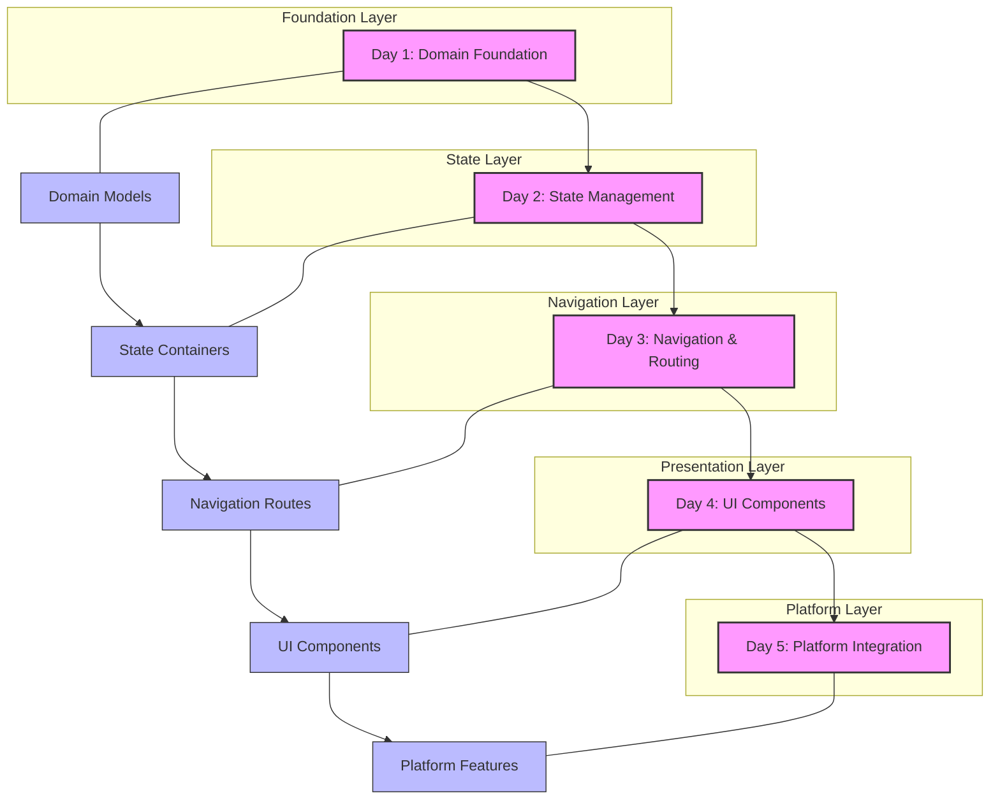

# PayPal Mobile Development Course

# Course Schedule

Below is the schedule of activities for the week:

## Weekly Schedule

| Time | Monday | Tuesday | Wednesday | Thursday | Friday |
|------|---------|----------|------------|-----------|---------|
| 9:00 AM | 🟦 [Domain Foundation](./lessons/01-domain-foundation/README.md) | 🟦 [State Management](./lessons/02-state-management/README.md) | 🟦 [Navigation and Routing](./lessons/03-navigation-routing/README.md) | 🟦 [UI Components](./lessons/04-ui-components/README.md) | 🟦 [Platform Integration](./lessons/05-platform-integration/README.md) |
| 9:30 AM | 🟦 (continued) | 🟦 (continued) | 🟦 (continued) | 🟦 (continued) | 🟦 (continued) |
| 10:00 AM | 🟦 (continued) | 🟦 (continued) | 🟦 (continued) | 🟦 (continued) | 🟦 (continued) |
| 10:30 AM | 🟩 [Domain Foundation Lab](./lessons/01-domain-foundation/lab/README.md) | 🟩 [State Management Lab](./lessons/02-state-management/lab/README.md) | 🟩 [Navigation Lab](./lessons/03-navigation-routing/lab/README.md) | 🟩 [UI Components Lab](./lessons/04-ui-components/lab/README.md) | 🟩 [Platform Lab](./lessons/05-platform-integration/lab/README.md) |
| 11:00 AM | 🟩 (continued) | 🟩 (continued) | 🟩 (continued) | 🟩 (continued) | 🟩 (continued) |
| 11:30 AM | 🟩 (continued) | 🟩 (continued) | 🟩 (continued) | 🟩 (continued) | 🟩 (continued) |
| 12:00 PM | Lunch | Lunch | Lunch | Lunch | Lunch |
| 1:00 PM | 🟦 [State Management](./lessons/02-state-management/README.md) | 🟦 [Navigation and Routing](./lessons/03-navigation-routing/README.md) | 🟦 [UI Components](./lessons/04-ui-components/README.md) | 🟦 [Platform Integration](./lessons/05-platform-integration/README.md) | 🟦 Course Review |
| 1:30 PM | 🟦 (continued) | 🟦 (continued) | 🟦 (continued) | 🟦 (continued) | 🟦 (continued) |
| 2:00 PM | 🟦 (continued) | 🟦 (continued) | 🟦 (continued) | 🟦 (continued) | 🟦 (continued) |
| 2:30 PM | 🟩 [State Management Lab](./lessons/02-state-management/lab/README.md) | 🟩 [Navigation Lab](./lessons/03-navigation-routing/lab/README.md) | 🟩 [UI Components Lab](./lessons/04-ui-components/lab/README.md) | 🟩 [Platform Lab](./lessons/05-platform-integration/lab/README.md) | 🟩 Final Project |
| 3:00 PM | 🟩 (continued) | 🟩 (continued) | 🟩 (continued) | 🟩 (continued) | 🟩 (continued) |
| 3:30 PM | 🟩 (continued) | 🟩 (continued) | 🟩 (continued) | 🟩 (continued) | 🟩 (continued) |
| 4:00 PM | Daily Wrap-up | Daily Wrap-up | Daily Wrap-up | Daily Wrap-up | Course Conclusion |

## Course Overview
This intensive 40-hour course is designed specifically for PayPal backend engineers to develop practical skills in cross-platform mobile application development. The course focuses on building robust, user-friendly applications that can run on multiple platforms including iOS, Android, Web, Windows, MacOS, and Linux.

## Learning Journey: The Big Picture

### Professional Development Approach
This course takes a unique "inside-out" approach to mobile development, starting with domain models and business logic rather than UI components. This professional approach:

- **Mirrors Real-World Development**: Enterprise applications begin with domain modeling and architecture, not UI design
- **Prioritizes Security**: Financial applications require robust security at the domain level
- **Ensures Maintainability**: Clean architecture principles lead to more maintainable codebases
- **Enables Testability**: Proper separation of concerns allows for comprehensive testing

### Course Progression and Connections

The course follows a deliberate progression where each day builds upon the previous:

1. **Domain Foundation → State Management**
   - Domain models provide the data structures that state containers manage
   - Business rules from the domain layer inform state transitions
   - Value objects ensure data integrity throughout the state

2. **State Management → Navigation & Routing**
   - Navigation decisions depend on application state
   - Route protection requires authentication state
   - Deep links need state context for proper handling

3. **Navigation & Routing → UI Components**
   - UI components receive context from navigation routes
   - Screen transitions follow navigation patterns
   - Component hierarchy reflects navigation structure

4. **UI Components → Platform Integration**
   - UI components interact with platform-specific features
   - Error handling in UI connects to platform-specific recovery
   - Accessibility features leverage platform capabilities

### Lab Integration Strategy

Each day includes hands-on labs that reinforce lesson concepts:

- **Morning Labs**: Apply concepts from the morning lesson
- **Afternoon Labs**: Extend morning work with more advanced features
- **Progressive Complexity**: Labs build upon each other, creating a cohesive application
- **Real-World Scenarios**: Labs simulate actual PayPal development challenges

By the final day, students will have built a complete financial application with:
- Robust domain models and business logic
- Sophisticated state management
- Secure navigation and deep linking
- Professional UI components
- Platform-specific security features

### Why This Approach Matters for PayPal

This course structure directly addresses the unique challenges of financial application development:

- **Security First**: Security is built into the foundation, not added as an afterthought
- **Compliance Ready**: Architecture supports audit requirements and regulatory compliance
- **Enterprise Scale**: Patterns support the complexity of enterprise financial applications
- **Cross-Platform Consistency**: Core business logic remains consistent across platforms
- **Maintainable Codebase**: Clean architecture principles support long-term maintenance

By the end of this course, engineers will not only know how to build cross-platform mobile applications but will understand how to build them the right way for financial contexts—with security, maintainability, and user experience as primary considerations.

## Target Audience
Backend engineers at PayPal who want to expand their skillset to include modern cross-platform mobile development.

## Learning Outcomes
By the end of this course, students will be able to:
- Demonstrate a deep understanding of platform-dependent and platform-agnostic development approaches
- Build multi-screen applications with API integration, state management, and local storage
- Deploy cross-platform applications to both Google Play and Apple App Store
- Implement best practices for mobile app performance and usability

## Course Structure
- Duration: 40 hours
- Format: 5 days, 8 hours per day (including 1-hour lunch break)
- Delivery: In-person bootcamp with hands-on coding sessions
- Repository: All lessons and materials available through GitHub

## Daily Schedule
- Morning Session: 4 hours
- Lunch Break: 1 hour
- Afternoon Session: 3 hours

## Course Themes

### Day 1: Domain Foundation
- Introduction to domain-driven design
- Core concepts and principles
- Understanding domain modeling
- Setting up the development environment

### Day 2: State Management
- State management concepts
- Provider pattern
- Riverpod implementation
- Complex application state

### Day 3: Navigation and Routing
- Multi-screen navigation
- Go-router implementation
- Navigation patterns
- Deep linking

### Day 4: UI Components
- Building responsive layouts
- Forms and user input
- Material Design implementation
- Custom UI components

### Day 5: Platform Integration and Deployment
- Platform-specific features
- Native functionality integration
- App store deployment
- Performance optimization

## Teaching Approach
- Hands-on coding sessions
- Practical exercises
- Real-world examples
- Interactive problem-solving

## Prerequisites
- Backend development experience
- Basic understanding of mobile development concepts
- Familiarity with version control (Git)

## Course Materials
All course materials, including code examples, exercises, and solutions, are available in this repository:
- 📚 Lesson markdown files
- 💻 Starter code
- ✅ Solution code
- 🧪 Test files
