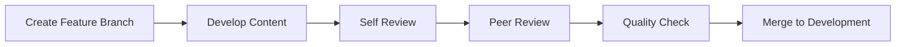

# GitHub Repository Architecture

## Repository Structure

```
course-name/
├── README.md                 # Course overview and navigation
├── assets/                   # Shared resources
│   ├── images/              # Images and screenshots
│   └── diagrams/            # Architectural and concept diagrams
├── lessons/                 # Individual lesson content
│   ├── 01-lesson-name/     # Lesson folders (numbered for order)
│   │   ├── README.md       # Main lesson content
│   │   └── examples/       # Lesson-specific examples
│   └── ...
├── resources/              # Supplementary materials
│   └── reference-materials/
├── documentation/          # Course documentation
├── quality-control/        # Review and validation tools
├── tools/                  # Course-specific utilities
├── styles/                # Shared styles and snippets
├── planning/              # Curriculum planning docs
├── maintenance/           # Maintenance procedures
├── student-resources/     # Student-specific materials
├── feedback/              # Feedback templates
└── cross-references/      # Cross-reference documentation
```

## Branch Strategy

### Main Branches
- `main` - Production-ready content
- `development` - Integration branch for new content
- `staging` - Content review and testing

### Feature Branches
- `feature/lesson-name` - New lesson development
- `fix/issue-description` - Bug fixes
- `update/content-description` - Content updates
- `docs/documentation-updates` - Documentation changes

## Workflow Guidelines

### 1. Content Development


### 2. Review Process
1. **Self Review**
   - Use lesson-review-checklist.md
   - Validate against style-guide.md
   - Test all code examples
   - Check all links and resources

2. **Peer Review**
   - Technical accuracy review
   - Content clarity review
   - Accessibility check
   - Student experience evaluation

3. **Quality Control**
   - Run automated checks
   - Validate against guidelines
   - Test in target environment
   - Verify all media assets

### 3. Merge Requirements
- All checklist items completed
- Peer review approved
- Quality control passed
- No merge conflicts
- Up-to-date with development branch

## Content Management

### Version Control
- Semantic versioning for course releases
- Clear commit messages following style guide
- Regular backups of course materials
- Version tags for major updates

### Asset Management
- Images optimized for web
- Diagrams in source format
- Shared resources centralized
- Clear naming conventions

### Documentation Updates
- Keep README files current
- Update cross-references
- Maintain change logs
- Document deprecations

## Maintenance Procedures

### Regular Updates
- Weekly content reviews
- Monthly technical validation
- Quarterly comprehensive review
- Annual curriculum evaluation

### Issue Handling
1. Issue reported/identified
2. Categorize and prioritize
3. Assign to maintainer
4. Create fix branch
5. Implement and test solution
6. Review and merge
7. Update documentation

### Quality Assurance
- Automated testing where possible
- Manual content review
- Student feedback integration
- Instructor input collection

## Collaboration Guidelines

### Pull Requests
- Use PR template
- Include clear description
- Reference related issues
- Add relevant labels
- Request appropriate reviewers

### Code Review
- Check against style guide
- Verify technical accuracy
- Test code examples
- Review documentation updates

### Communication
- Clear commit messages
- Detailed PR descriptions
- Regular status updates
- Documentation of decisions

## Best Practices

### Content Creation
- Follow style guide strictly
- Use templates consistently
- Include practical examples
- Maintain accessibility

### Repository Management
- Regular backups
- Clean branch history
- Updated documentation
- Clear ownership

### Quality Control
- Automated checks
- Peer reviews
- Student feedback
- Regular audits

## Emergency Procedures

### Content Issues
1. Identify severity
2. Create hotfix branch
3. Implement fix
4. Emergency review
5. Deploy to main
6. Update documentation

### System Issues
1. Repository backup
2. Access control review
3. Permission updates
4. Security audits
5. Recovery procedures

## Support and Resources

### Documentation
- Style Guide
- Content Guidelines
- Review Checklist
- Architecture Guide

### Tools
- Content validators
- Link checkers
- Style enforcers
- Quality control scripts

### Contact
- Repository maintainers
- Content reviewers
- Technical support
- Emergency contacts
