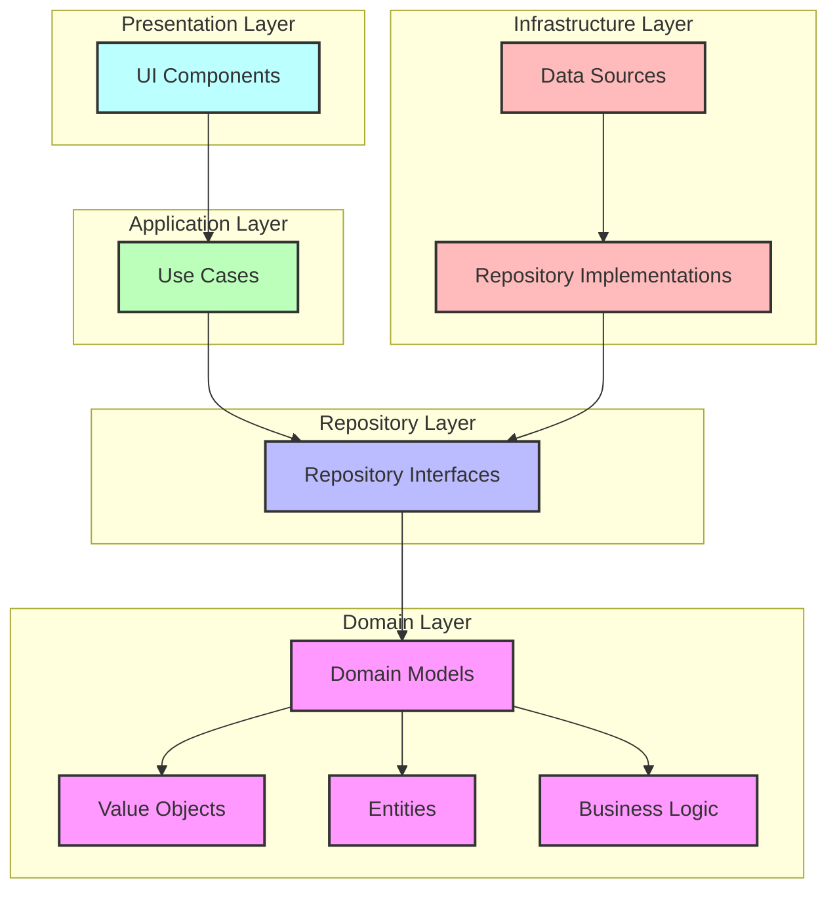

# Domain Foundation (Flutter Foundations)

**Time Required:** 90 minutes

**Learning Objectives:** By the end of this lesson, engineers will be able to:
- Design and implement domain models for financial data
- Create clean architecture interfaces
- Establish repository patterns
- Set up a testable foundation
- Understand domain-driven design principles


## Prerequisites
- Flutter SDK installed (version 3.0+)
- Basic Dart programming knowledge
- Understanding of OOP principles


## Lesson Roadmap

### 1. Domain Models (30 min)
- Transaction model
- Value objects
- Validation rules
- Business logic

### 2. Repository Patterns (30 min)
- Interface design
- Error handling
- Data access patterns
- Repository contracts

### 3. Clean Architecture (30 min)
- Layer separation
- Dependency rules
- Interface segregation
- Testing patterns


## Conceptual Framework

Before diving into the technical implementation, let's understand the key concepts and their relationships in building a solid foundation for mobile applications.

### Why This Foundation Matters

Starting with a strong domain foundation is crucial for building robust financial applications:

- **Data Integrity**: Financial applications handle sensitive data where accuracy is non-negotiable
- **Security**: A well-designed domain layer helps enforce security rules at the data level
- **Maintainability**: Clean architecture makes it easier to update and extend your application
- **Testability**: Proper separation of concerns enables thorough testing of business logic

### Visual Representation

The following diagram illustrates how the key concepts in this lesson work together:



### Key Concepts Explained

1. **Domain Models**: The core business objects that represent your application's data and behavior
   - **Value Objects**: Immutable objects defined by their attributes (like Money, TransactionDate)
   - **Entities**: Objects with identity that can change over time (like Transaction, Account)
   - **Business Logic**: Rules that govern how your data behaves and changes

2. **Repository Pattern**: Interfaces that define how to access and store domain objects
   - Acts as a collection of domain objects
   - Hides data access implementation details
   - Enables testability through mocking

3. **Clean Architecture**: A design approach that separates concerns into layers
   - Domain layer contains business rules and is independent of other layers
   - Repository interfaces belong to the domain layer
   - Repository implementations belong to the infrastructure layer
   - Dependencies point inward toward the domain layer

### Real-World Application

In financial applications like PayPal:

- **Transaction Processing**: Domain models ensure that transactions maintain integrity
- **Money Handling**: Value objects prevent common financial calculation errors
- **Data Validation**: Business rules in the domain layer prevent invalid data
- **Testing**: Clean architecture enables thorough testing of business logic

By building on these foundations, you'll create applications that are more secure, maintainable, and adaptable to changing requirements.


## Development Environment Setup
**Time Required:** 15 minutes

### Project Navigation
1. Navigate to this lesson's directory:
   ```bash
   cd lessons/01-domain-foundation/lab/starter
   ```

2. Get dependencies:
   ```bash
   flutter pub get
   ```

> 💡 **Pro Tip:**  
> If you closed your IDE since the last lesson, reopen the project:
> - VS Code: `code .`
> - Android Studio: Open the `starter` directory

### Verification
1. Run the starter app:
   ```bash
   flutter run
   ```

2. Verify the following:
   - App launches successfully
   - No console errors
   - Hot reload works (press 'r' in terminal)

> ⚠️ **Warning:**  
> If you encounter any errors, ensure all dependencies are properly installed and you're in the correct directory.


## Introduction
While traditionally Flutter courses might start with UI components, we're starting with domain modeling to follow professional development practices. A solid domain foundation is crucial for building maintainable, scalable financial applications.

> 💡 **Key Concept:**  
> Domain models define your business logic and data structures. They form the foundation of your application and should be independent of UI or platform-specific code.


## Domain Layer Implementation

Let's implement a robust domain model:

<details>
<summary>View Implementation</summary>

```dart
// lib/features/transactions/domain/models/transaction.dart

class Transaction {
    final String id;
    final Money amount;
    final String description;
    final DateTime date;
    final TransactionStatus status;
    
    // Constructor with validation
    const Transaction({
        required this.id,
        required this.amount,
        required this.description,
        required this.date,
        required this.status,
    }) {
        if (id.isEmpty) {
            throw InvalidTransactionException('ID cannot be empty');
        }
        if (description.isEmpty) {
            throw InvalidTransactionException('Description cannot be empty');
        }
    }
    
    // Business logic methods
    bool get isCredit => amount.value > 0;
    bool get isRecent => date.isAfter(DateTime.now().subtract(
        const Duration(days: 7),
    ));
    
    // Validation methods
    bool isValidAmount() => amount.value.abs() <= 1000000;
    bool requiresApproval() => amount.value.abs() > 10000;
    
    // Helper methods
    String get formattedDate => DateFormat.yMMMd().format(date);
    String get statusText => status.displayName;
}

// Value object for money
class Money {
    final double value;
    final String currency;
    
    const Money({
        required this.value,
        this.currency = 'USD',
    });
    
    String get formatted => '\$${value.toStringAsFixed(2)}';
    
    Money operator +(Money other) {
        if (currency != other.currency) {
            throw InvalidCurrencyException(
                'Cannot add different currencies',
            );
        }
        return Money(
            value: value + other.value,
            currency: currency,
        );
    }
}
```

**Verification Steps:**
1. Create test transactions
2. Verify validation rules
3. Test business logic
4. Check value object operations
</details>


## Repository Pattern Implementation

Let's define our repository interface:

<details>
<summary>View Implementation</summary>

```dart
// lib/features/transactions/domain/repositories/transaction_repository.dart

abstract class TransactionRepository {
    Future<List<Transaction>> getTransactions();
    Future<Transaction> getTransactionById(String id);
    Future<List<Transaction>> getTransactionsByDate(
        DateTime start,
        DateTime end,
    );
    Future<void> saveTransaction(Transaction transaction);
}

// Custom exceptions
class TransactionException implements Exception {
    final String message;
    final String? code;
    
    const TransactionException(
        this.message, {
        this.code,
    });
    
    @override
    String toString() => 'TransactionException: $message${
        code != null ? ' ($code)' : ''
    }';
}

class TransactionNotFoundException extends TransactionException {
    TransactionNotFoundException(String id)
        : super('Transaction not found: $id', code: 'NOT_FOUND');
}
```

**Verification Steps:**
1. Implement mock repository
2. Test error handling
3. Verify exception handling
4. Check async operations
</details>


## Testing Strategy

<details>
<summary>View Test Implementation</summary>

```dart
// test/features/transactions/domain/models/transaction_test.dart

void main() {
    group('Transaction', () {
        test('validates constructor parameters', () {
            expect(
                () => Transaction(
                    id: '',
                    amount: Money(value: 100),
                    description: 'Test',
                    date: DateTime.now(),
                    status: TransactionStatus.completed,
                ),
                throwsA(isA<InvalidTransactionException>()),
            );
        });
        
        test('calculates isCredit correctly', () {
            final transaction = Transaction(
                id: '1',
                amount: Money(value: 100),
                description: 'Test',
                date: DateTime.now(),
                status: TransactionStatus.completed,
            );
            
            expect(transaction.isCredit, true);
        });
    });
    
    group('Money', () {
        test('handles addition correctly', () {
            final m1 = Money(value: 100);
            final m2 = Money(value: 200);
            
            final result = m1 + m2;
            
            expect(result.value, 300);
            expect(result.currency, 'USD');
        });
        
        test('prevents adding different currencies', () {
            final m1 = Money(value: 100, currency: 'USD');
            final m2 = Money(value: 200, currency: 'EUR');
            
            expect(
                () => m1 + m2,
                throwsA(isA<InvalidCurrencyException>()),
            );
        });
    });
}
```
</details>


## Common Issues and Solutions

| Issue | Bad Practice | Good Practice |
|-------|-------------|---------------|
| Domain Logic | Logic in UI | Logic in domain models |
| Validation | Runtime checks | Constructor validation |
| Money Handling | Using double directly | Using Money value object |
| Error Handling | Generic exceptions | Domain-specific exceptions |


## Looking Ahead

In the next lesson (State Management), we'll:
- Implement repository patterns
- Add state management
- Handle data persistence
- Manage errors


## Additional Resources

- [Domain-Driven Design](https://martinfowler.com/bliki/DomainDrivenDesign.html)
- [Clean Architecture](https://blog.cleancoder.com/uncle-bob/2012/08/13/the-clean-architecture.html)
- [Value Objects](https://martinfowler.com/bliki/ValueObject.html)
- [Repository Pattern](https://martinfowler.com/eaaCatalog/repository.html)
- [Testing Guide](https://flutter.dev/docs/testing)
