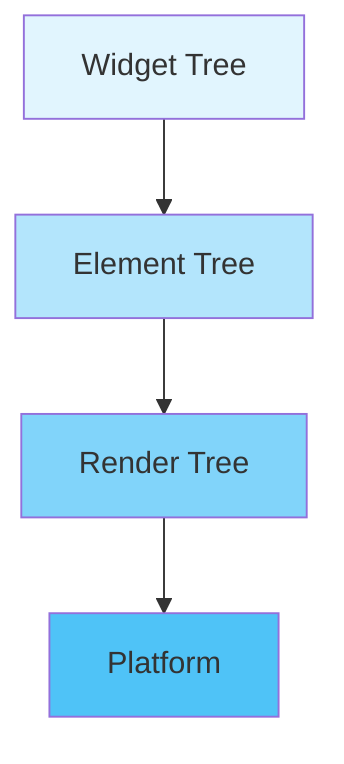

# Flutter Foundations

**Time Required:** 90 minutes

**Learning Objectives:** By the end of this lesson, engineers will be able to:
- Explain Flutter's architecture and how it achieves native performance
- Understand the widget system and its role in building UIs
- Use Flutter DevTools to analyze and debug applications
- Implement proper widget composition and lifecycle management
- Apply enterprise-grade project organization patterns


## Prerequisites
- Flutter SDK installed (version 3.0+)
- Android Studio or VS Code with Flutter extensions
- Basic Dart programming knowledge


## Development Environment Setup
**Time Required:** 15 minutes

### Environment Verification
1. Open a terminal and verify Flutter installation:
   ```bash
   flutter doctor
   ```
   
   Expected output:
   ```
   [✓] Flutter (Channel stable, v3.0.0)
   [✓] Android toolchain
   [✓] VS Code (version 1.70.0)
   ```

2. Navigate to the course repository:
   ```bash
   cd PayPal-Mobile-Development
   ```

> 📝 **Note:**  
> Ensure all checkmarks are green. Yellow or red indicators need attention before proceeding.

### Project Structure
The lesson files are organized as follows:
```
lessons/01-flutter-foundations/
├── README.md           # Lesson content
└── lab/
    ├── starter/       # Your working directory
    └── solution/      # Reference implementations
```

### Setup Steps
1. Navigate to the lesson directory:
   ```bash
   cd lessons/01-flutter-foundations/lab/starter
   ```

2. Get dependencies:
   ```bash
   flutter pub get
   ```

3. Open in your IDE:
   - VS Code: `code .`
   - Android Studio: Open the `starter` directory

> 💡 **Pro Tip:**  
> Keep your terminal running throughout the lesson for hot reload capability (press 'r' to reload).

### Verification
1. Run the starter app:
   ```bash
   flutter run
   ```

2. Verify the following:
   - App launches successfully
   - No console errors
   - Hot reload works

### Common Issues

| Issue | Solution |
|-------|----------|
| Flutter not found | Add Flutter to PATH: `export PATH="$PATH:[flutter_install]/bin"` |
| License issues | Run: `flutter doctor --android-licenses` |
| IDE plugins | Install Flutter extension in VS Code or Android Studio |

> ⚠️ **Warning:**  
> If `flutter doctor` shows any red X's, resolve them before continuing with the lesson.


## Introduction
Flutter represents a paradigm shift in cross-platform development, offering native performance while maintaining a single codebase. This lesson explores Flutter's core architecture and fundamental concepts that enable efficient mobile application development.

> 💡 **Key Concept:**  
> Flutter achieves native performance by directly controlling every pixel on the screen through its custom rendering engine, bypassing the platform's native UI components.


## Lesson Roadmap

### 1. Flutter Architecture Deep Dive (30 min)
- Cross-platform architecture
- Widget system fundamentals
- Build and render pipeline

### 2. Development Environment Setup (15 min)
- IDE configuration
- DevTools installation
- Project creation

### 3. Widget System Exploration (30 min)
- Widget types and lifecycle
- Widget composition patterns
- Performance considerations

### 4. Enterprise Project Structure (15 min)
- Feature-based organization
- Dependency management
- Code sharing strategies


## Flutter Architecture

Flutter uses a unique architecture that enables high-performance cross-platform development:

### Component Layers

1. **Widget Layer**
   - Declarative UI building
   - Immutable widget objects
   - Composition over inheritance

2. **Element Tree**
   - Maintains widget state
   - Handles widget lifecycle
   - Manages rebuilds

3. **Render Tree**
   - Layout calculation
   - Paint operations
   - Platform rendering

> 📝 **Note:**  
> The architecture diagram below illustrates the flow from Widget definition to platform rendering:



### Key Architecture Points
- Widgets serve as blueprints for UI elements
- Elements maintain the actual UI state
- RenderObjects handle layout and painting
- Platform layer provides native rendering


## Widget System Fundamentals

Flutter's widget system follows key principles:

### 1. Immutability

```dart
// Widgets are immutable and use final fields
class MyWidget extends StatelessWidget {
    // Final field ensures immutability
    final String title;
    
    // Required constructor with named parameter
    const MyWidget({
        required this.title,
        Key? key,
    }) : super(key: key);
    
    @override
    Widget build(BuildContext context) {
        return Text(title);
    }
}
```

### 2. Composition

```dart
// Build complex UIs through widget composition
class ProfileCard extends StatelessWidget {
    @override
    Widget build(BuildContext context) {
        return Card(
            child: Column(
                children: [
                    Avatar(),
                    UserInfo(),
                    ActionButtons(),
                ],
            ),
        );
    }
}
```

### 3. State Management

```dart
// Separate state from widget definition
class Counter extends StatefulWidget {
    @override
    _CounterState createState() => _CounterState();
}

class _CounterState extends State<Counter> {
    int _count = 0;
    
    void _increment() {
        setState(() => _count++);
    }
    
    @override
    Widget build(BuildContext context) {
        return Text('Count: $_count');
    }
}
```

> ⚠️ **Warning:**  
> Always use `setState()` to modify state variables. Direct modifications won't trigger rebuilds.


## Implementation Walkthrough

Let's build a secure transaction component:

<details>
<summary>View Implementation</summary>

```dart
// lib/features/transactions/presentation/transaction_card.dart

class TransactionCard extends StatelessWidget {
    final Transaction transaction;
    
    // Define constants outside build method for better performance
    static const double _padding = 16.0;
    static const double _spacing = 8.0;
    
    const TransactionCard({
        required this.transaction,
        Key? key,
    }) : super(key: key);
    
    @override
    Widget build(BuildContext context) {
        return Card(
            child: Padding(
                padding: EdgeInsets.all(_padding),
                child: Column(
                    crossAxisAlignment: CrossAxisAlignment.start,
                    children: [
                        _buildHeader(),
                        SizedBox(height: _spacing),
                        _buildAmount(),
                        SizedBox(height: _spacing),
                        _buildStatus(),
                    ],
                ),
            ),
        );
    }
    
    Widget _buildHeader() {
        return Row(
            children: [
                Icon(Icons.payment),
                SizedBox(width: _spacing),
                Text(
                    transaction.description,
                    style: TextStyle(
                        fontSize: 18.0,
                        fontWeight: FontWeight.bold,
                    ),
                ),
            ],
        );
    }
    
    Widget _buildAmount() {
        return Text(
            '\$${transaction.amount.toStringAsFixed(2)}',
            style: TextStyle(
                fontSize: 24.0,
                color: transaction.amount >= 0 
                    ? Colors.green 
                    : Colors.red,
            ),
        );
    }
    
    Widget _buildStatus() {
        return Container(
            padding: EdgeInsets.symmetric(
                horizontal: 8.0,
                vertical: 4.0,
            ),
            decoration: BoxDecoration(
                color: _getStatusColor(),
                borderRadius: BorderRadius.circular(4.0),
            ),
            child: Text(
                transaction.status.toString(),
                style: TextStyle(color: Colors.white),
            ),
        );
    }
    
    Color _getStatusColor() {
        switch (transaction.status) {
            case TransactionStatus.completed:
                return Colors.green;
            case TransactionStatus.pending:
                return Colors.orange;
            case TransactionStatus.failed:
                return Colors.red;
        }
    }
}
```

**Verification Steps:**
1. Create a new transaction card instance
2. Verify all sections render properly
3. Test different transaction states
4. Check responsive behavior
</details>


## DevTools Analysis

### Widget Inspector
1. Locate TransactionCard in the widget tree
2. Verify the nested structure:
   ```
   TransactionCard
   └─ Card
      └─ Padding
         └─ Column
            ├─ Row (Header)
            │  ├─ Icon
            │  ├─ SizedBox
            │  └─ Text
            ├─ SizedBox
            ├─ Text (Amount)
            ├─ SizedBox
            └─ Container (Status)
               └─ Text
   ```

### Performance Optimization

> 💡 **Pro Tip:**  
> Define constants outside the build method to prevent unnecessary object creation.

#### Common Issues and Solutions

| Issue | Bad Practice | Good Practice |
|-------|-------------|---------------|
| Object Creation | New instances in build | Static constants |
| Heavy Computation | Processing in build | Memoized values |
| Widget Rebuilds | Large rebuild areas | Targeted updates |


## Testing Best Practices

<details>
<summary>View Test Implementation</summary>

```dart
// test/widgets/transaction_card_test.dart

void main() {
    group('TransactionCard', () {
        testWidgets('displays transaction details', (tester) async {
            final transaction = Transaction(
                id: '1',
                amount: 100.0,
                description: 'Test Payment',
                status: TransactionStatus.completed,
            );
            
            await tester.pumpWidget(MaterialApp(
                home: TransactionCard(transaction: transaction),
            ));
            
            // Verify structure and content
            expect(find.byType(Card), findsOneWidget);
            expect(find.text('Test Payment'), findsOneWidget);
            expect(find.text('\$100.00'), findsOneWidget);
            
            // Verify styling
            final amountWidget = tester.widget<Text>(
                find.text('\$100.00'),
            );
            expect(amountWidget.style?.color, Colors.green);
        });
    });
}
```
</details>


## Looking Ahead

In the next lesson, we'll explore:
- Complex financial UI components
- Secure user input handling
- Responsive layout patterns
- Custom styling implementation


## Additional Resources

- [Flutter Architecture](https://flutter.dev/docs/resources/architectural-overview)
- [Widget Catalog](https://flutter.dev/docs/development/ui/widgets)
- [DevTools Guide](https://flutter.dev/docs/development/tools/devtools/overview)
- [Performance Best Practices](https://flutter.dev/docs/perf/rendering/best-practices)
- [Testing Guide](https://flutter.dev/docs/testing)
