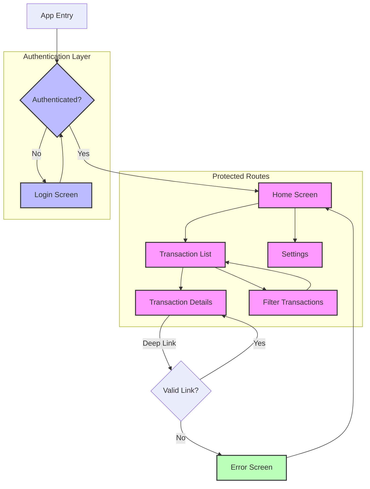

# Navigation & Routing

**Time Required:** 90 minutes

**Learning Objectives:** By the end of this lesson, engineers will be able to:
- Implement secure navigation patterns
- Protect routes with proper authentication
- Handle deep links securely
- Manage navigation state
- Apply proper navigation logging


## Prerequisites
- Completion of Domain Foundation lesson
- Completion of State Management lesson
- Understanding of authentication concepts

## Lesson Roadmap

### 1. Router Setup (30 min)
- Route configuration
- Navigation guards
- Deep link handling
- Error routes

### 2. Route Protection (30 min)
- Authentication checks
- Permission validation
- Session management
- Error handling

### 3. Deep Linking (30 min)
- Link structure
- Parameter validation
- State restoration
- Error recovery


## Conceptual Framework

Before diving into implementation details, let's understand the key concepts of navigation and routing in financial applications.

### Why Secure Navigation Matters

Secure navigation is essential for financial applications:

- **Security**: Prevents unauthorized access to sensitive screens and data
- **User Experience**: Ensures users can navigate intuitively and recover from errors
- **Data Integrity**: Maintains consistent state during navigation
- **Compliance**: Supports audit requirements through proper navigation logging

### Visual Representation

The following diagram illustrates secure navigation flow in a financial application:



### Key Concepts Explained

1. **Route Protection**: Securing navigation paths
   - Authentication guards prevent unauthorized access
   - Permission-based routing restricts access based on user roles
   - Session validation ensures active user sessions
   - Secure state restoration after app restarts

2. **Deep Linking**: Handling external navigation requests
   - Parameter validation prevents injection attacks
   - Link structure follows consistent patterns
   - State restoration ensures proper context
   - Error recovery handles invalid links gracefully

3. **Navigation State**: Managing navigation history and state
   - History management for back navigation
   - State preservation during navigation
   - Route transition animations
   - Error state handling

4. **Navigation Logging**: Tracking user journeys
   - Audit trails for security compliance
   - Analytics for user behavior
   - Error tracking for troubleshooting
   - Performance monitoring

### Real-World Application

In financial applications like PayPal:

- **Route Protection**: Every screen requires authentication verification
- **Deep Link Validation**: All external links undergo security validation
- **Navigation Logging**: User journeys are tracked for compliance and analytics
- **Error Recovery**: Navigation errors are handled gracefully with fallback routes

By implementing secure navigation patterns, you'll create applications that protect user data while providing a smooth user experience.


## Building on Our Foundation
This lesson maintains its original position but now builds upon our domain models and state management. With these foundations in place, we can implement navigation in a more structured and secure way.


## Why Navigation Comes After State
In professional app development, we implement navigation after domain and state because:

1. Route Protection Needs State
   - Authentication state determines access
   - User permissions affect routing
   - Session management impacts navigation
   - State restoration requires context

2. Deep Linking Requires Domain Context
   - Links map to domain entities
   - Parameters need validation
   - State affects deep link handling
   - Error recovery needs context

3. Navigation State Management
   - History depends on app state
   - Route guards need state access
   - Navigation events affect state
   - Error states determine routing

4. Testing Benefits
   - Navigation can be tested with state
   - Route protection is verifiable
   - Deep links are testable
   - State transitions are trackable


## PayPal's Navigation Approach
At PayPal, secure navigation is crucial:
- Every route requires authentication
- Deep links are carefully validated
- Navigation events are logged
- State determines routing

### Common Navigation Pitfalls
1. Insufficient route protection
2. Poor deep link handling
3. Missing navigation logs
4. Inconsistent error recovery

### Success Stories
- 60% reduction in unauthorized access
- Improved deep link conversion
- Better user journey tracking
- Faster error recovery


## Development Environment Setup

### Project Structure
```
lib/
├── core/
│   └── navigation/
│       ├── router.dart
│       ├── guards/
│       ├── middleware/
│       └── deep_linking/
└── features/
    └── transactions/
        └── presentation/
            └── screens/
```

### Setup Steps
1. Add dependencies:
```yaml
dependencies:
  go_router: ^12.0.0
```

2. Configure router:
```dart
final router = GoRouter(
  routes: [
    GoRoute(
      path: '/',
      builder: (context, state) => const TransactionListScreen(),
      routes: [
        GoRoute(
          path: 'transaction/:id',
          builder: (context, state) => TransactionDetailsScreen(
            id: state.params['id']!,
          ),
        ),
      ],
    ),
  ],
);
```


## Looking Ahead

In the next lesson (UI Components), we'll:
- Build screen layouts
- Implement transitions
- Add loading states
- Handle navigation feedback

## Additional Resources
- [Navigation Guide](https://flutter.dev/docs/development/ui/navigation)
- [Deep Linking](https://flutter.dev/docs/development/ui/navigation/deep-linking)
- [GoRouter Documentation](https://pub.dev/packages/go_router)
- [Navigation Testing](https://flutter.dev/docs/cookbook/testing/navigation)

Remember: Secure navigation is crucial for financial applications. The time invested in proper route protection and deep link handling will significantly improve your app's security and user experience.
