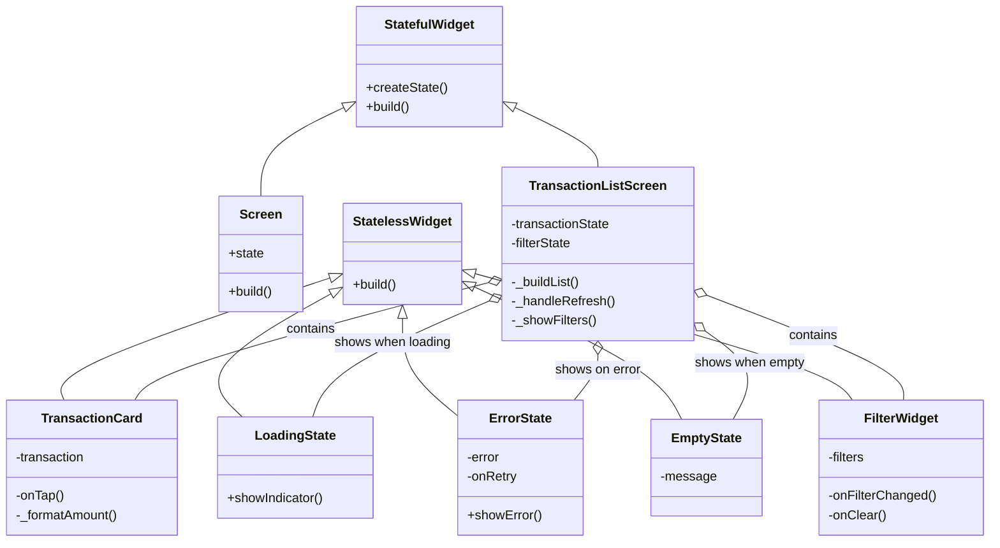

# UI Components (Widget Essentials)

**Time Required:** 90 minutes

**Learning Objectives:** By the end of this lesson, engineers will be able to:
- Build reusable UI components with proper state integration
- Implement responsive layouts and transitions
- Handle loading and error states effectively
- Create accessible and user-friendly interfaces
- Apply proper widget composition patterns


## Prerequisites
- Completion of Domain Foundation lesson
- Completion of State Management lesson
- Completion of Navigation & Routing lesson
- Understanding of Flutter widgets


## Lesson Roadmap

### 1. Transaction List Screen (30 min)
- List view implementation
- Pull-to-refresh
- Search and filters
- Loading states

### 2. Transaction Details Screen (30 min)
- Detailed view layout
- Timeline display
- Status updates
- Error handling

### 3. Reusable Components (30 min)
- Loading indicators
- Error displays
- Filter widgets
- Status badges


## Conceptual Framework

Before diving into implementation details, let's understand the key concepts of UI components in financial applications.

### Why UI Component Design Matters

Well-designed UI components are crucial for financial applications:

- **Trust**: Professional UI components build user confidence in financial transactions
- **Usability**: Intuitive components reduce user errors in critical financial operations
- **Accessibility**: Properly designed components ensure all users can access financial services
- **Consistency**: Unified component design creates a cohesive user experience

### Visual Representation

The following diagram illustrates the component hierarchy and state integration in a financial application:



### Key Concepts Explained

1. **Component Composition**: Building complex UIs from simple components
   - Reusable building blocks improve maintainability
   - Composition over inheritance promotes flexibility
   - Clear component boundaries improve testability
   - Consistent patterns enhance developer productivity

2. **State Integration**: Connecting UI components to application state
   - Components react to state changes
   - State access is controlled and predictable
   - UI reflects the current application state
   - Error and loading states are handled consistently

3. **Responsive Design**: Adapting to different screen sizes and orientations
   - Fluid layouts adjust to available space
   - Adaptive components change behavior based on context
   - Consistent experience across devices
   - Accessibility considerations for all users

4. **Error Handling**: Displaying errors in a user-friendly way
   - Inline error states avoid disrupting user flow
   - Retry mechanisms help users recover from errors
   - Consistent error patterns build user confidence
   - Contextual error messages guide users to solutions

### Real-World Application

In financial applications like PayPal:

- **Transaction Cards**: Display financial data clearly with proper formatting
- **Loading States**: Non-blocking indicators maintain user context during operations
- **Error Handling**: Inline error states with recovery options
- **Accessibility**: All components meet accessibility standards for inclusive design

By implementing well-designed UI components, you'll create applications that are more usable, trustworthy, and accessible to all users.


## Development Environment Setup
**Time Required:** 15 minutes

### Project Navigation
1. Navigate to this lesson's directory:
   ```bash
   cd lessons/04-ui-components/lab/starter
   ```

2. Get dependencies:
   ```bash
   flutter pub get
   ```

> 💡 **Pro Tip:**  
> If you closed your IDE since the last lesson, reopen the project:
> - VS Code: `code .`
> - Android Studio: Open the `starter` directory

### Project Structure
```
lib/
├── features/
│   └── transactions/
│       └── presentation/
│           ├── screens/
│           │   ├── transaction_list_screen.dart
│           │   └── transaction_details_screen.dart
│           └── widgets/
│               ├── transaction_card.dart
│               ├── transaction_filters.dart
│               └── loading_states.dart
```

### Verification
1. Run the starter app:
   ```bash
   flutter run
   ```

2. Verify the following:
   - App launches successfully
   - No console errors
   - Hot reload works (press 'r' in terminal)

> ⚠️ **Warning:**  
> If you encounter any errors, ensure all dependencies are properly installed and you're in the correct directory.


## Introduction
Now that we have our domain models, state management, and navigation in place, we can build UI components that integrate with these foundations. This approach ensures our UI is driven by well-structured data and state.

> 💡 **Key Concept:**  
> UI components should be presentation-focused, delegating business logic to the domain layer and state management to dedicated state containers.


## Screen Implementation

Let's implement the transaction list screen:

<details>
<summary>View Implementation</summary>

```dart
// lib/features/transactions/presentation/screens/transaction_list_screen.dart

class TransactionListScreen extends ConsumerWidget {
    const TransactionListScreen({super.key});
    
    @override
    Widget build(BuildContext context, WidgetRef ref) {
        final state = ref.watch(transactionProvider);
        final filters = ref.watch(filterProvider);
        
        return Scaffold(
            appBar: AppBar(
                title: const Text('Transactions'),
                actions: [
                    IconButton(
                        icon: const Icon(Icons.filter_list),
                        onPressed: () => _showFilters(context, ref),
                    ),
                ],
            ),
            body: Column(
                children: [
                    TransactionSearchBar(
                        query: filters.searchQuery,
                        onChanged: (query) => ref.read(filterProvider)
                            .setSearchQuery(query),
                    ),
                    if (filters.hasActiveFilters)
                        FilterChips(
                            filters: filters,
                            onClear: () => ref.read(filterProvider)
                                .clearFilters(),
                        ),
                    Expanded(
                        child: _buildTransactionList(state),
                    ),
                ],
            ),
        );
    }
    
    Widget _buildTransactionList(TransactionState state) {
        if (state.loading) {
            return const LoadingIndicator();
        }
        
        if (state.error != null) {
            return ErrorDisplay(
                error: state.error!,
                onRetry: () => state.refreshTransactions(),
            );
        }
        
        if (state.transactions.isEmpty) {
            return const EmptyState(
                message: 'No transactions found',
            );
        }
        
        return RefreshIndicator(
            onRefresh: () => state.refreshTransactions(),
            child: ListView.builder(
                itemCount: state.transactions.length,
                itemBuilder: (context, index) {
                    final transaction = state.transactions[index];
                    return TransactionCard(
                        transaction: transaction,
                        onTap: () => context.go(
                            Routes.transactionDetails(transaction.id),
                        ),
                    );
                },
            ),
        );
    }
}
```

**Verification Steps:**
1. Test pull-to-refresh
2. Verify filter functionality
3. Check loading states
4. Test error handling
</details>


## Component Implementation

Let's create reusable components:

<details>
<summary>View Implementation</summary>

```dart
// lib/features/transactions/presentation/widgets/loading_states.dart

class LoadingIndicator extends StatelessWidget {
    const LoadingIndicator({super.key});
    
    @override
    Widget build(BuildContext context) {
        return const Center(
            child: Column(
                mainAxisAlignment: MainAxisAlignment.center,
                children: [
                    CircularProgressIndicator(),
                    SizedBox(height: 16),
                    Text('Loading transactions...'),
                ],
            ),
        );
    }
}

class ErrorDisplay extends StatelessWidget {
    final String error;
    final VoidCallback onRetry;
    
    const ErrorDisplay({
        required this.error,
        required this.onRetry,
        super.key,
    });
    
    @override
    Widget build(BuildContext context) {
        return Center(
            child: Column(
                mainAxisAlignment: MainAxisAlignment.center,
                children: [
                    Icon(
                        Icons.error_outline,
                        color: Theme.of(context).colorScheme.error,
                        size: 48,
                    ),
                    const SizedBox(height: 16),
                    Text(
                        error,
                        textAlign: TextAlign.center,
                        style: Theme.of(context).textTheme.bodyLarge,
                    ),
                    const SizedBox(height: 16),
                    ElevatedButton(
                        onPressed: onRetry,
                        child: const Text('Retry'),
                    ),
                ],
            ),
        );
    }
}
```

**Verification Steps:**
1. Test loading animation
2. Verify error display
3. Check retry functionality
4. Test responsive layout
</details>


## Testing Strategy

<details>
<summary>View Test Implementation</summary>

```dart
// test/features/transactions/presentation/screens/transaction_list_screen_test.dart

void main() {
    group('TransactionListScreen', () {
        late MockTransactionState state;
        late MockFilterState filters;
        
        setUp(() {
            state = MockTransactionState();
            filters = MockFilterState();
            
            when(() => state.loading).thenReturn(false);
            when(() => state.error).thenReturn(null);
            when(() => state.transactions).thenReturn([]);
        });
        
        testWidgets('shows loading indicator', (tester) async {
            when(() => state.loading).thenReturn(true);
            
            await tester.pumpWidget(
                ProviderScope(
                    overrides: [
                        transactionProvider.overrideWithValue(state),
                        filterProvider.overrideWithValue(filters),
                    ],
                    child: const MaterialApp(
                        home: TransactionListScreen(),
                    ),
                ),
            );
            
            expect(find.byType(LoadingIndicator), findsOneWidget);
            expect(find.byType(ListView), findsNothing);
        });
        
        testWidgets('shows error display', (tester) async {
            when(() => state.error).thenReturn('Test error');
            
            await tester.pumpWidget(/* ... */);
            
            expect(find.byType(ErrorDisplay), findsOneWidget);
            expect(find.text('Test error'), findsOneWidget);
            
            await tester.tap(find.text('Retry'));
            verify(() => state.refreshTransactions()).called(1);
        });
    });
}
```
</details>


## Common Issues and Solutions

| Issue | Bad Practice | Good Practice |
|-------|-------------|---------------|
| State Access | Direct state mutation | Using providers |
| Error Display | Alert dialogs | Inline error states |
| Loading States | Blocking UI | Non-blocking indicators |
| Widget Rebuilds | Large rebuild areas | Targeted updates |

> 📝 **Note:**  
> Keep widgets focused on presentation, delegating business logic to the appropriate layers of your application.


## Looking Ahead

In the next lesson (Platform Integration), we'll:
- Add platform-specific features
- Implement biometric auth
- Handle notifications
- Prepare for deployment


## Additional Resources

- [Flutter Widget Catalog](https://flutter.dev/docs/development/ui/widgets)
- [Material Design Guidelines](https://material.io/design)
- [Responsive Design](https://flutter.dev/docs/development/ui/layout/responsive)
- [Widget Testing](https://flutter.dev/docs/cookbook/testing/widget/introduction)

Remember: UI components should be the final layer of your application, built on top of a solid foundation of domain models, state management, and navigation.
