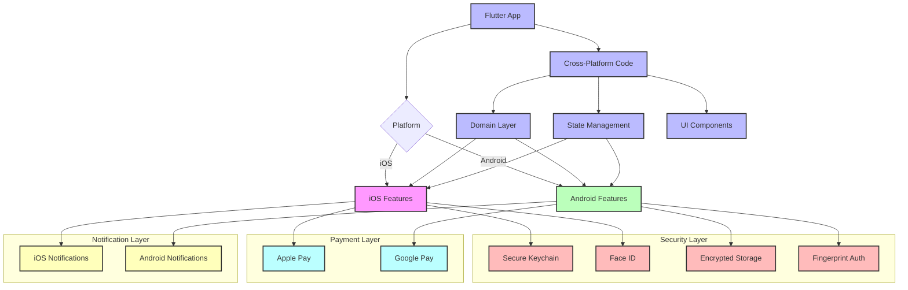

# Platform Integration in Flutter

**Time Required:** 120 minutes

**Learning Objectives:** By the end of this lesson, engineers will be able to:
- Implement secure biometric authentication
- Handle platform-specific security features
- Manage secure data storage across platforms
- Configure secure push notifications
- Prepare apps for enterprise deployment


## Prerequisites
- Flutter SDK installed (version 3.0+)
- Basic understanding of Flutter widgets
- Completion of Domain Foundation lesson
- Completion of State Management lesson
- Completion of Navigation & Routing lesson
- Completion of UI Components lesson


## Lesson Roadmap

### 1. Biometric Security (30 min)
- Authentication patterns
- Platform differences
- Error handling

### 2. Secure Storage (30 min)
- Platform-specific storage
- Encryption strategies
- Key management

### 3. Push Notifications (30 min)
- Secure configuration
- Payload handling
- Platform differences

### 4. Enterprise Deployment (30 min)
- Security requirements
- Platform guidelines
- Release preparation


## Conceptual Framework

Before diving into implementation details, let's understand the key concepts of platform integration in financial applications.

### Why Platform Integration Matters

Proper platform integration is crucial for financial applications:

- **Security**: Native platform security features provide stronger protection for financial data
- **User Experience**: Platform-specific features create a more natural and familiar experience
- **Performance**: Direct platform integration enables better performance for critical operations
- **Compliance**: Financial regulations often require platform-specific security measures

### Visual Representation

The following diagram illustrates platform integration in a financial application:



### Key Concepts Explained

1. **Biometric Authentication**: Using device-specific biometric features
   - Face ID on iOS devices
   - Fingerprint on Android devices
   - Secure fallback mechanisms
   - Consistent cross-platform API

2. **Secure Storage**: Platform-specific data protection
   - Keychain on iOS
   - EncryptedSharedPreferences on Android
   - Hardware-backed encryption
   - Key management strategies

3. **Push Notifications**: Platform-specific notification systems
   - APNs for iOS
   - FCM for Android
   - Secure payload handling
   - Background processing

4. **Platform Channels**: Communication between Flutter and native code
   - Method channels for function calls
   - Event channels for streams
   - Platform-specific implementations
   - Error handling across platforms

### Real-World Application

In financial applications like PayPal:

- **Biometric Verification**: Transactions require biometric verification
- **Secure Storage**: Sensitive data is stored in platform-specific secure storage
- **Secure Notifications**: Financial alerts are delivered securely
- **Platform Compliance**: Implementation meets platform-specific security requirements

By implementing proper platform integration, you'll create applications that leverage the best security features of each platform while maintaining a consistent user experience.


## Development Environment Setup
**Time Required:** 10 minutes

### Project Navigation
1. Navigate to this lesson's directory:
   ```bash
   cd lessons/05-platform-integration/lab/starter
   ```

2. Get dependencies:
   ```bash
   flutter pub get
   ```

> 💡 **Pro Tip:**  
> If you closed your IDE since the last lesson, reopen the project:
> - VS Code: `code .`
> - Android Studio: Open the `starter` directory

### Verification
1. Run the starter app:
   ```bash
   flutter run
   ```

2. Verify the following:
   - App launches successfully
   - No console errors
   - Hot reload works (press 'r' in terminal)

> ⚠️ **Warning:**  
> If you encounter any errors, ensure all dependencies are properly installed and you're in the correct directory.


## Introduction
Platform integration in financial applications requires careful consideration of security features and platform-specific requirements. This lesson explores implementing robust platform integrations while maintaining security and user experience.

> 💡 **Key Concept:**  
> Platform integration must leverage native security features while maintaining a consistent cross-platform experience and security model.


## Biometric Authentication

Financial applications require robust biometric security:

### 1. Authentication Types
- Fingerprint
- Face recognition
- Platform-specific methods

### 2. Security Considerations
- Biometric validation
- Fallback mechanisms
- Audit logging

> ⚠️ **Warning:**  
> Always provide secure fallback mechanisms for cases where biometric authentication is unavailable or fails.


## Implementation Walkthrough

Let's implement secure biometric authentication:

<details>
<summary>View Implementation</summary>

```dart
// lib/platform/biometric_auth.dart

class BiometricService {
    final LocalAuthentication _auth;
    final SecureStorage _storage;
    final BiometricLogger _logger;
    
    const BiometricService({
        required LocalAuthentication auth,
        required SecureStorage storage,
        required BiometricLogger logger,
    }) : _auth = auth,
         _storage = storage,
         _logger = logger;
    
    Future<bool> authenticate({
        required String reason,
        required String action,
    }) async {
        try {
            // Check availability
            if (!await _auth.canCheckBiometrics) {
                await _logger.logError(
                    'Biometrics not available',
                    action,
                );
                return false;
            }
            
            // Get available methods
            final biometrics = await _auth.getAvailableBiometrics();
            if (biometrics.isEmpty) {
                await _logger.logError(
                    'No biometrics enrolled',
                    action,
                );
                return false;
            }
            
            // Authenticate with options
            final authenticated = await _auth.authenticate(
                localizedReason: reason,
                options: const AuthenticationOptions(
                    stickyAuth: true,
                    biometricOnly: true,
                    sensitiveTransaction: true,
                ),
            );
            
            // Log result
            await _logger.logAuthentication(
                action,
                authenticated,
            );
            
            return authenticated;
            
        } catch (e) {
            await _logger.logError(
                'Authentication failed: $e',
                action,
            );
            return false;
        }
    }
    
    Future<bool> verifyTransaction(
        Transaction transaction,
    ) async {
        try {
            // Get stored hash
            final storedHash = await _storage.getBiometricHash();
            if (storedHash == null) {
                await _logger.logError(
                    'No biometric hash found',
                    'verify_transaction',
                );
                return false;
            }
            
            // Verify biometric
            final authenticated = await authenticate(
                reason: 'Verify transaction of ${transaction.amount}',
                action: 'verify_transaction',
            );
            
            if (!authenticated) return false;
            
            // Verify hash
            final currentHash = await _generateBiometricHash();
            return currentHash == storedHash;
            
        } catch (e) {
            await _logger.logError(
                'Transaction verification failed: $e',
                'verify_transaction',
            );
            return false;
        }
    }
}
```

**Verification Steps:**
1. Test biometric availability
2. Verify authentication flow
3. Check error handling
4. Test fallback mechanisms
5. Verify audit logging
</details>


## Secure Storage

Let's implement platform-specific secure storage:

<details>
<summary>View Implementation</summary>

```dart
// lib/platform/secure_storage.dart

class SecureStorage {
    final FlutterSecureStorage _storage;
    final EncryptionService _encryption;
    final StorageLogger _logger;
    
    SecureStorage({
        required FlutterSecureStorage storage,
        required EncryptionService encryption,
        required StorageLogger logger,
    }) : _storage = storage,
         _encryption = encryption,
         _logger = logger;
    
    Future<void> saveSecureData(
        String key,
        String value,
    ) async {
        try {
            // Encrypt data
            final encrypted = await _encryption.encrypt(value);
            
            // Use platform options
            await _storage.write(
                key: key,
                value: encrypted,
                iOptions: _getIOSOptions(),
                aOptions: _getAndroidOptions(),
            );
            
            // Log operation
            await _logger.logStorage(
                'save',
                key,
            );
            
        } catch (e) {
            await _logger.logError(
                'Save failed: $e',
                key,
            );
            rethrow;
        }
    }
    
    IOSOptions _getIOSOptions() => const IOSOptions(
        accessibility: KeychainAccessibility.whenUnlockedThisDeviceOnly,
        synchronizable: false,
    );
    
    AndroidOptions _getAndroidOptions() => const AndroidOptions(
        encryptedSharedPreferences: true,
    );
}
```

**Verification Steps:**
1. Test data encryption
2. Verify platform-specific storage
3. Check error handling
4. Test data retrieval
5. Verify secure deletion
</details>


## Push Notifications

### Secure Configuration

> 💡 **Pro Tip:**  
> Always validate and sanitize push notification payloads before processing them.

```dart
// Secure notification configuration
final notificationConfig = NotificationConfiguration(
    encryptPayloads: true,
    requireAuthentication: true,
    validateOrigin: true,
);
```

### Implementation Example

<details>
<summary>View Implementation</summary>

```dart
// lib/platform/notification_service.dart

class NotificationService {
    final FirebaseMessaging _messaging;
    final NotificationLogger _logger;
    
    NotificationService({
        required FirebaseMessaging messaging,
        required NotificationLogger logger,
    }) : _messaging = messaging,
         _logger = logger;
    
    Future<void> initialize() async {
        try {
            // Request permission
            final settings = await _messaging.requestPermission(
                alert: true,
                badge: true,
                sound: true,
            );
            
            if (settings.authorizationStatus == 
                AuthorizationStatus.authorized) {
                // Get token
                final token = await _messaging.getToken();
                await _logger.logToken(token);
                
                // Configure handlers
                FirebaseMessaging.onMessage
                    .listen(_handleForegroundMessage);
                FirebaseMessaging.onMessageOpenedApp
                    .listen(_handleBackgroundMessage);
                FirebaseMessaging.onBackgroundMessage(
                    _handleBackgroundMessage,
                );
            }
            
        } catch (e) {
            await _logger.logError('Initialization failed', e);
        }
    }
    
    Future<void> _handleForegroundMessage(
        RemoteMessage message,
    ) async {
        try {
            // Validate payload
            if (!isValidPayload(message.data)) {
                await _logger.logError(
                    'Invalid payload',
                    message.data.toString(),
                );
                return;
            }
            
            // Show notification
            await _showLocalNotification(
                title: message.notification?.title ?? '',
                body: message.notification?.body ?? '',
                payload: message.data,
            );
            
            // Log receipt
            await _logger.logNotification(
                'foreground',
                message.messageId ?? '',
            );
            
        } catch (e) {
            await _logger.logError('Foreground handler failed', e);
        }
    }
}
```
</details>


## Testing Strategy

<details>
<summary>View Test Implementation</summary>

```dart
// test/platform/biometric_service_test.dart

void main() {
    group('BiometricService', () {
        late MockLocalAuthentication auth;
        late MockSecureStorage storage;
        late MockBiometricLogger logger;
        late BiometricService service;
        
        setUp(() {
            auth = MockLocalAuthentication();
            storage = MockSecureStorage();
            logger = MockBiometricLogger();
            service = BiometricService(
                auth: auth,
                storage: storage,
                logger: logger,
            );
        });
        
        test('checks biometric availability', () async {
            when(() => auth.canCheckBiometrics)
                .thenAnswer((_) async => true);
                
            final result = await service.authenticate(
                reason: 'Test',
                action: 'test_auth',
            );
            
            expect(result, true);
            verify(() => logger.logAuthentication(any(), any()))
                .called(1);
        });
        
        test('handles authentication errors', () async {
            when(() => auth.authenticate(
                localizedReason: any(named: 'localizedReason'),
            )).thenThrow(Exception('Auth failed'));
            
            final result = await service.authenticate(
                reason: 'Test',
                action: 'test_auth',
            );
            
            expect(result, false);
            verify(() => logger.logError(any(), any()))
                .called(1);
        });
    });
}
```
</details>


## Looking Ahead

Next steps for platform integration:
- Add more biometric methods
- Enhance secure storage
- Improve notifications
- Prepare for deployment


## Additional Resources

- [Local Auth Plugin](https://pub.dev/packages/local_auth)
- [Secure Storage](https://pub.dev/packages/flutter_secure_storage)
- [Firebase Messaging](https://pub.dev/packages/firebase_messaging)
- [Platform Integration Guide](https://flutter.dev/docs/development/platform-integration)
- [Security Best Practices](https://flutter.dev/docs/security)
